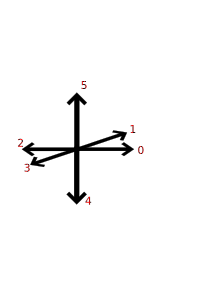
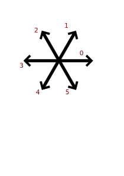
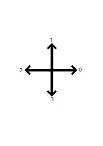

<h1>Self avoiding-walk</h1>

Groepsopdracht voor programmeren in de wiskunde over self avoiding waks

<h2>Overzicht van functies</h2>

<h3>__init__(self,template="2dsquare",direction_vectors=None)</h3>
<table>
<tr><th>template<th>Het template rooster dat gebruikt wordt. Mogelijke waarden zijn: "2dsquare", "3dcubic", "4dcubic", "2dtriangle", None. Als er niet gebruik gemaakt word van een template moet dit gelijk zijn aan None<th><tr>
<tr><th>direction_vectors<th>Lijst richtingsvectoren van het rooster. Als er een template gebruikt  wordt moet dit gelijk zijn aan None.<th><tr>
</table>
Initialiseert de klasse

<h3>pop(self,n=1)</h3>
<table>
    <tr><th>n<th>Hoeveelheid punten dat van wandeling verwijderd moet worden.<th></tr>
</table>
Haalt punten weg van het einde van de wandeling
<h3>go_direction(self,direction)</h3>
<table>
    <tr><th>direction<th>Is een index van <b>direction_vectors</b>. Het geeft de richting aan van de stap.
</table>
Zet een stap in een gegeven richting.
<h3>possible_walks(self,N)</h3>
<table>
<tr><th>N</th><th>De lengte van de wandelingen</th></tr>
</table>
Telt alle mogelijke wandelingen met lengte N vanuit de oorsprong die gecreërt kunnen worden.
<h3>possible_walks_faster(self,N)</h3>
<table>
  <tr><th>N<th>De lengte van de wandelingen<th><tr>
</table>
Telt alle mogelijke wandelingen met lengte N vanuit de oorsprong die gecreërt kunnen worden op een snellere manier dan dat <b>possible_walks</b> dat doet. Werkt alleen maar als het uiteinde van de wandeling op de oorsprong ligt.
<h3>plot(self)</h3>
Geeft een grafische weergave van de SAW. Dit werkt alleen als de template gelijk is aan "2dsquare" of "2dtriangle".

<h2>Richtingsvectoren voor de templates</h2>

In de volgende figuren ziet u voor de verschillende templates de indices van de richtingsvectoren.

